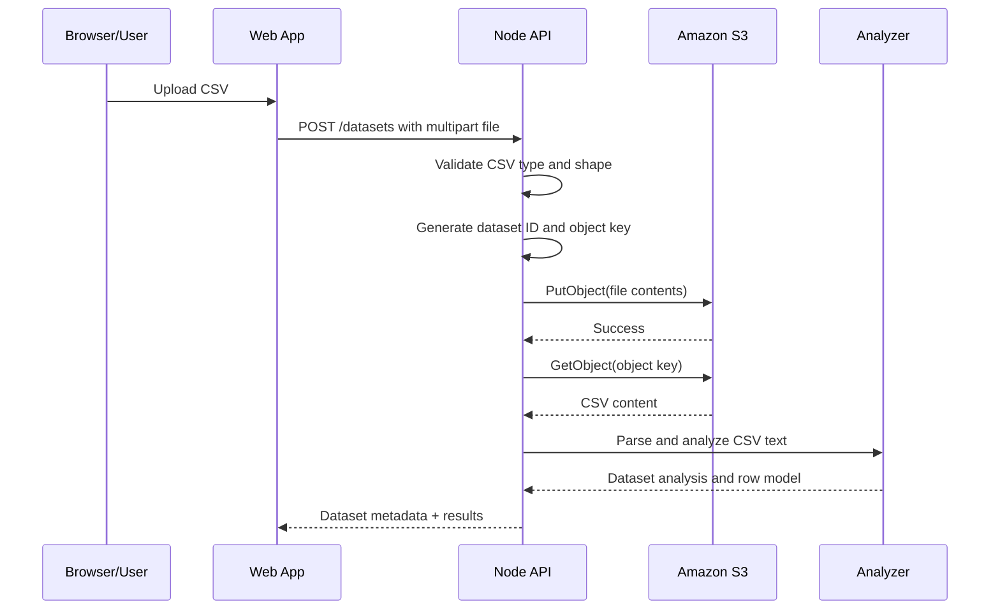

# S3 Integration Flow

## Purpose

CSV Insight stores uploaded CSV files in Amazon S3 so the original file is durable, isolated from the API process, and available to the analysis pipeline after a restart or redeploy.

This document describes the end-to-end S3 flow used by the application during Phase 2.

---

## System context

The current flow is:

1. Browser uploads a CSV to the API.
2. API validates the file.
3. API stores the original object in a private S3 bucket.
4. API reads the object back from S3.
5. API passes CSV text to the analyzer.
6. API keeps dataset metadata in memory for the current process.

The model is intentionally simple:

- S3 holds the durable source of truth for uploaded files.
- The API acts as the access layer and orchestrator.
- The analyzer remains decoupled from AWS-specific storage logic.

---

## High-level flow



---

## Object naming convention

Each upload is stored under a generated object key in the format:

```text
uploads/{datasetId}/{safe-file-name}
```

Example:

```text
uploads/7f6a43c5-40d8-4611-9452-68314a1c9a12/Quarterly-report-final-.csv
```

This pattern gives each dataset its own storage namespace and makes object lookup deterministic for a given dataset ID and file name.

---

## Integration logic

### 1. Environment configuration

The API expects these values in its environment:

```env
AWS_REGION=us-east-1
S3_BUCKET_NAME=csv-insight-data-ranganath-2026
```

The app uses the standard AWS credential provider chain from the local environment, such as:

- AWS SSO
- AWS profile via `AWS_PROFILE`
- EC2/ECS/Lambda role in deployed environments

No long-lived credentials are stored in the application config.

### 2. Client upload

The API receives the uploaded CSV through a multipart form request:

```text
POST /datasets
Form field: file
```

The API validates the file before continuing. If the file is invalid or is not a CSV, the request fails before any object upload is attempted.

### 3. Generate an object key

The service creates a unique key based on the dataset ID and the original file name, normalizing the filename to a safe S3-compatible name.

```ts
const s3ObjectKey = createS3ObjectKey(datasetId, file.name);
```

This ensures the object key is safe for S3 storage and consistent for later reads.

### 4. Write to S3

The API uploads the original file contents using `PutObject`:

```ts
await s3.uploadCsv(s3ObjectKey, fileBuffer);
```

The bucket is private and intended for backend-only access. Browser code never directly accesses S3.

### 5. Read back from S3

Once the object has been stored, the API retrieves the file content again with `GetObject`:

```ts
const csvText = await s3.readCsv(s3ObjectKey);
```

This read is the critical step that bridges storage and analysis. It ensures that the analyzer works from the exact bytes stored in S3, not a local temp file or an untrusted client-supplied value.

### 6. Analyze

The recovered text is passed to the analyzer layer for parsing, validation, statistics, and row access.

```ts
const analysis = analyzeCsv(csvText);
```

The analyzer does not know anything about S3. This separation keeps AWS concerns isolated and makes later migration easier.

### 7. Return response

The API then responds with dataset metadata and analysis results to the client. Metadata storage remains in memory for this phase, while the original file lives in S3.

---

## Error handling patterns

The S3 integration wraps provider errors to avoid leaking implementation details and to standardize failures.

Classes used by the service include:

- `S3ConfigurationError`
- `S3StorageError`

Typical behavior:

- Missing `AWS_REGION` or `S3_BUCKET_NAME` -> configuration error
- S3 request failures -> storage error with operation metadata
- API returns a controlled error response rather than raw AWS error text

This keeps client responses usable while preserving diagnostics in the server logs.

---

## IAM and permission model

The application only needs the minimum S3 permissions required for its work:

- `s3:PutObject` to store uploaded CSV files
- `s3:GetObject` to read the stored CSV back for analysis

The app does not need `s3:ListBucket` for the happy path. That is intentionally limited to reduce risk and to match the design of a direct object-based workflow.

Example least-privilege policy pattern:

```json
{
  "Version": "2012-10-17",
  "Statement": [
    {
      "Sid": "CsvInsightObjectAccess",
      "Effect": "Allow",
      "Action": [
        "s3:PutObject",
        "s3:GetObject"
      ],
      "Resource": "arn:aws:s3:::csv-insight-data-ranganath-2026/uploads/*"
    }
  ]
}
```

This scope keeps access limited to the application’s upload prefix instead of the entire bucket.

---

## Security notes

- Bucket should remain private.
- Browser clients should not receive any AWS credentials.
- The API should be the only component that calls the S3 SDK.
- Use AWS IAM roles for deployed workloads rather than embedding long-lived keys.
- Validate bucket name, region, and the active AWS identity before deployment.

If access is denied, check:

1. The AWS identity currently in use.
2. The bucket policy and IAM policy attached to that identity.
3. The exact ARN for the object being requested.
4. Whether the bucket is private and the request is using the correct region.

---

## Failure modes to watch

### Missing configuration

If `AWS_REGION` or `S3_BUCKET_NAME` is missing, the API fails immediately with a configuration error.

### Access denied

This usually means the AWS identity lacks `s3:PutObject` or `s3:GetObject` for the specific object path or the bucket policy blocks it.

### Network or AWS SDK issues

Transient AWS or network failures should be surfaced as S3 storage errors while keeping the public API contract stable.

### Object mismatch

If the upload is valid but the object read later fails, the system should fail cleanly rather than continuing with partial or stale data.

---

## Current implementation shape

The core logic is separated into two service layers:

- `apps/api/src/lib/s3.ts` — AWS configuration and validation
- `apps/api/src/services/s3.service.ts` — encapsulated S3 object operations

This keeps the app’s business logic from directly depending on AWS SDK details and makes the storage layer easy to test with mocked commands.

---

## Future evolution

This phase keeps dataset metadata in memory. A logical next step would be to move metadata persistence to a database or durable storage layer while continuing to keep original CSVs in S3. The architecture is already structured to support that evolution because the storage and analysis responsibilities are separated.

---

## Summary

The S3 integration flow is intentionally simple and robust:

- upload CSV to API
- validate file
- store original file in private S3 bucket
- read it back into the API
- analyze content
- return results to the client

This pattern preserves file durability and keeps storage concerns out of the front-end and analyzer layers.
